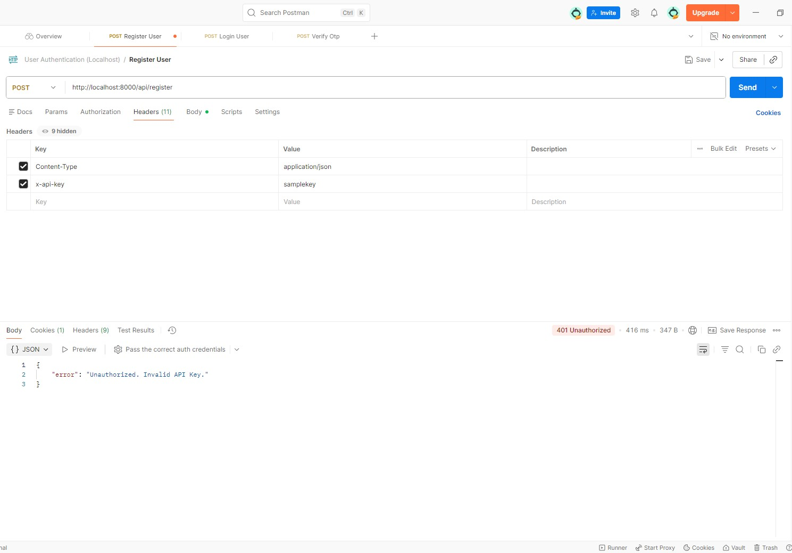
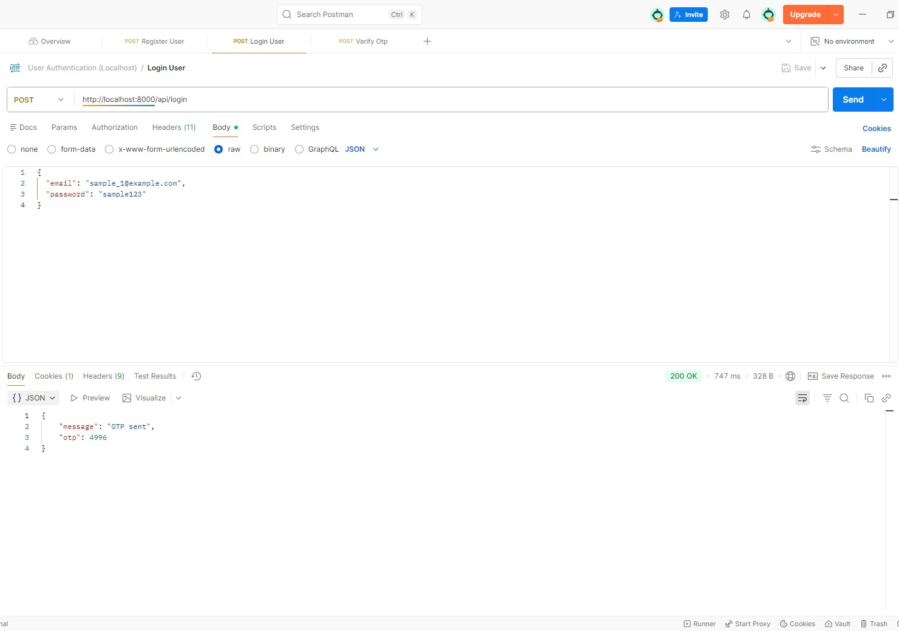
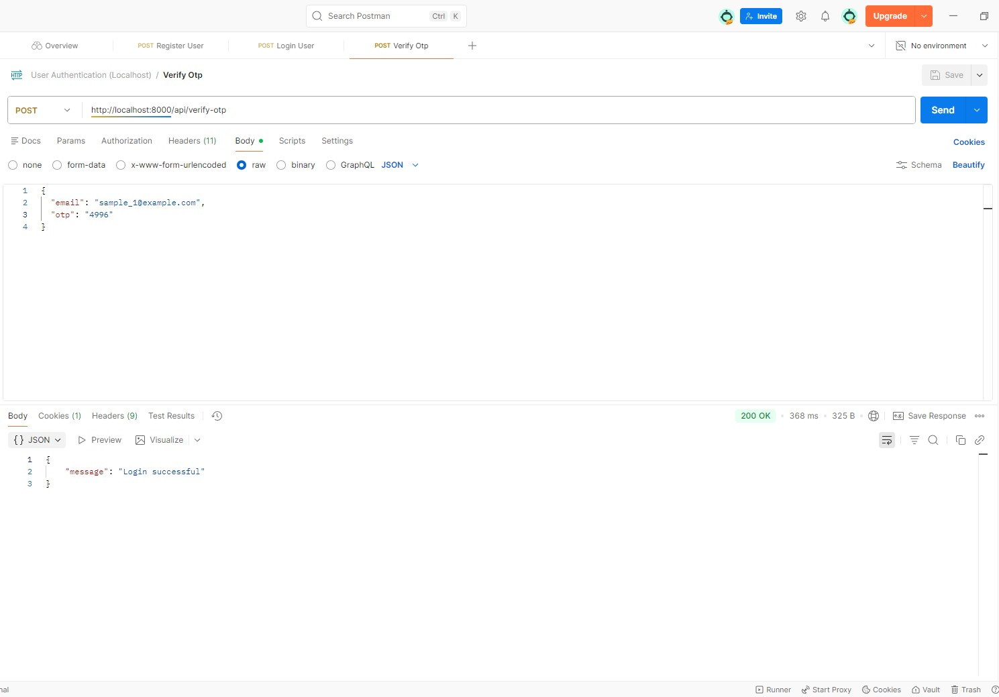

# User Authentication API (Symfony)

A backend authentication system built with **PHP (Symfony)** using
**API key–based access control** combined with **OTP (One-Time Password) authentication**.

This project is designed for learning, testing, and **portfolio demonstration purposes**.

---

## 🧾 Project Background

This project is a **recreated version** of an authentication system I originally developed in a professional environment in **2019**.

The original source code, company email, and repository are owned by the company and are no longer accessible to me. For this reason, this project was rebuilt from scratch to:

- Reproduce the **same authentication flow and business logic**
- Demonstrate my **real-world backend experience**
- Showcase my approach to **API security and OTP-based authentication**

While the codebase is not the original, the **system design, flow, and functionality closely reflect the production system** I worked on.

---

## 🚀 Features

- API key–protected REST endpoints
- User registration
- Login with OTP generation
- OTP verification with expiration
- Secure password hashing
- JSON-based REST API
- Middleware-based request protection
- Proper error handling (unauthorized, invalid OTP, etc.)

---

## 🛠 Tech Stack

- PHP 8+
- Symfony Framework
- Doctrine ORM
- MySQL / SQLite
- REST API (JSON)

---

## 🔐 Authentication Flow

1. Client sends request with `X-API-KEY` header
2. API key middleware validates access
3. User registers (once)
4. User logs in using email and password
5. Server generates a 4-digit OTP
6. OTP is stored with expiration
7. **OTP is returned in the API response (for testing/demo purposes)**
8. User verifies OTP to complete authentication

---

## ⚠️ Security Note

> In real production systems, OTPs should be delivered via
> email or SMS services and **must not be returned in API responses**.
>
> OTP is returned here strictly for **development, testing, and portfolio demonstration**.

---

## 📸 API Demo (Postman)

> Screenshots of actual API testing using Postman.
> API keys, emails, passwords, and sensitive data are redacted.

### 1) Unauthorized request (invalid API key)


### 2) Register user


### 3) Login → returns OTP (demo)


### 4) Verify OTP → Login successful


### 5) Invalid OTP example


---

## 📦 Installation

```bash
# 1. Install dependencies
composer install

# 2. Create your local environment file
cp .env.example .env.local

# 3. Edit .env.local and set:
#    - APP_SECRET
#    - APP_API_KEY
#    - DATABASE_URL (if needed)

# 4. Create database & run migrations
php bin/console doctrine:database:create
php bin/console doctrine:migrations:migrate

# 5. Run the server
php -S localhost:8000 -t public/
